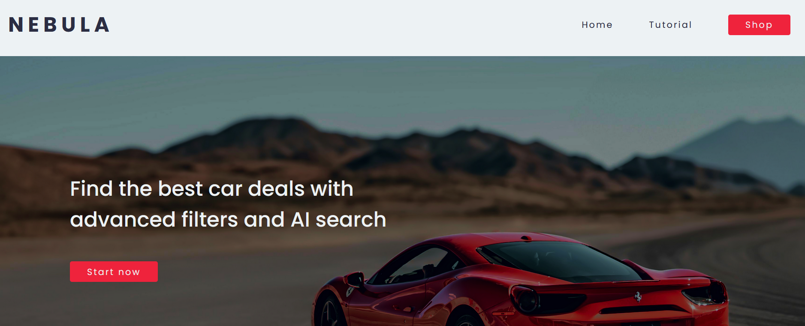
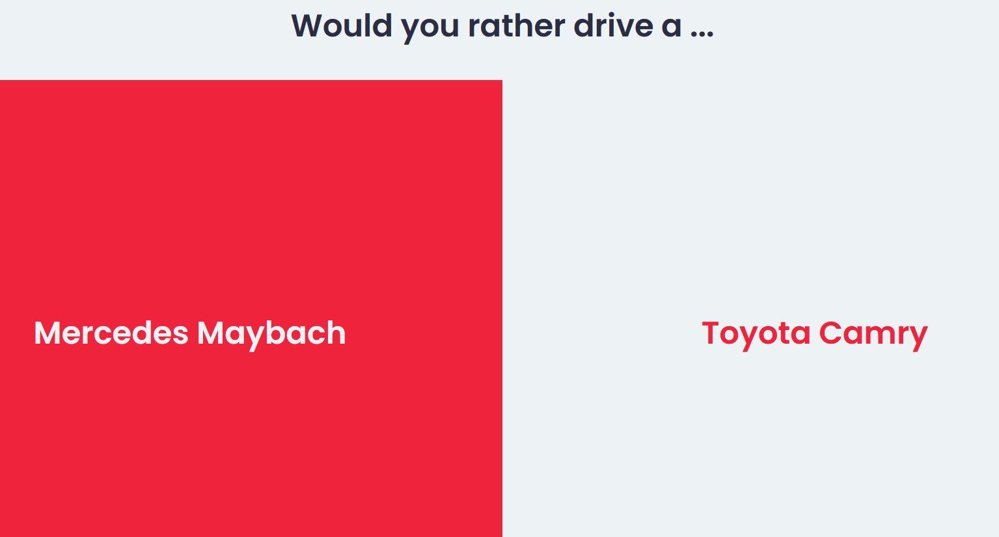
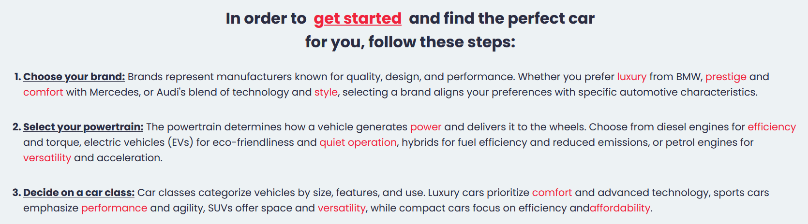
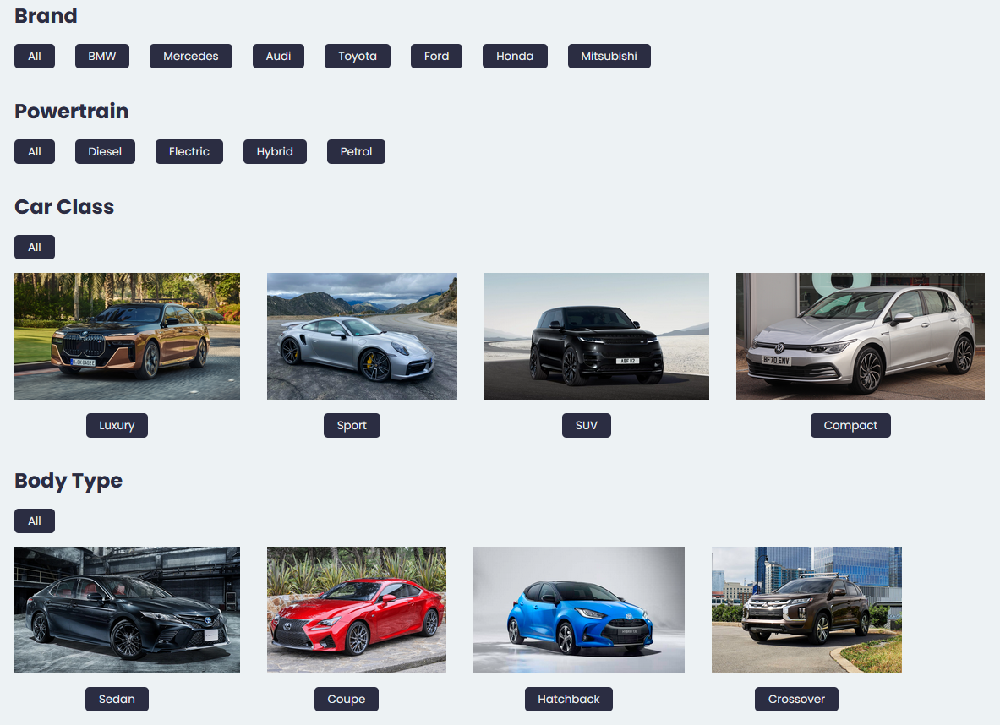
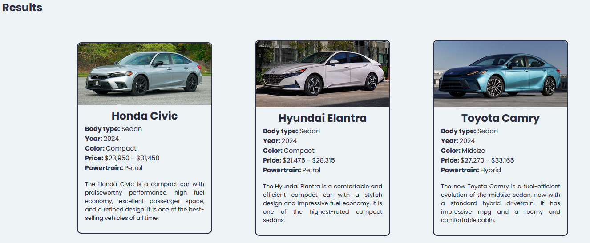

# Nebula
Ultimate car research app. It simplifies car-buying by leveraging AI to aggregate listings and provide tailored results, making it easy for everyone, regardless of their automotive knowledge.

## Contributors
- [Sufferal](https://github.com/Sufferal)
- [Syn4z](https://github.com/Syn4z)
- [Grena30](https://github.com/Grena30)
- [Buffaloss](https://github.com/buffaloss)
- [Muffindud](https://github.com/muffindud)

## Features
- AI generated and personalized recommendations
- Predefined filters
- AI-powered keyword search
- User-friendly interface
- Guided onboarding experience

## Usage
1. Clone the repository
```
git clone https://github.com/Grena30/Summer-Hackathon.git
```

2. Install the dependencies
```
npm install
```
```
pip install -r requirements.txt
```

3. Run the app
```
npm run dev
```
```
python main.py
```

## Frontend
- React
- Material-UI

## Backend
- Flask
- Python

## AI
- Cohere 

## Screenshots
### Home 



### Guide


### Tutorial


### Filters


### Recommendations
